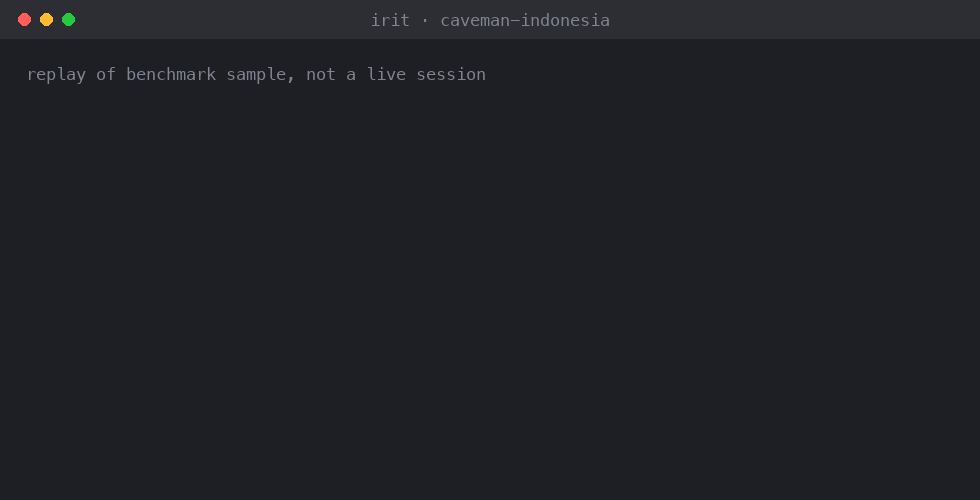
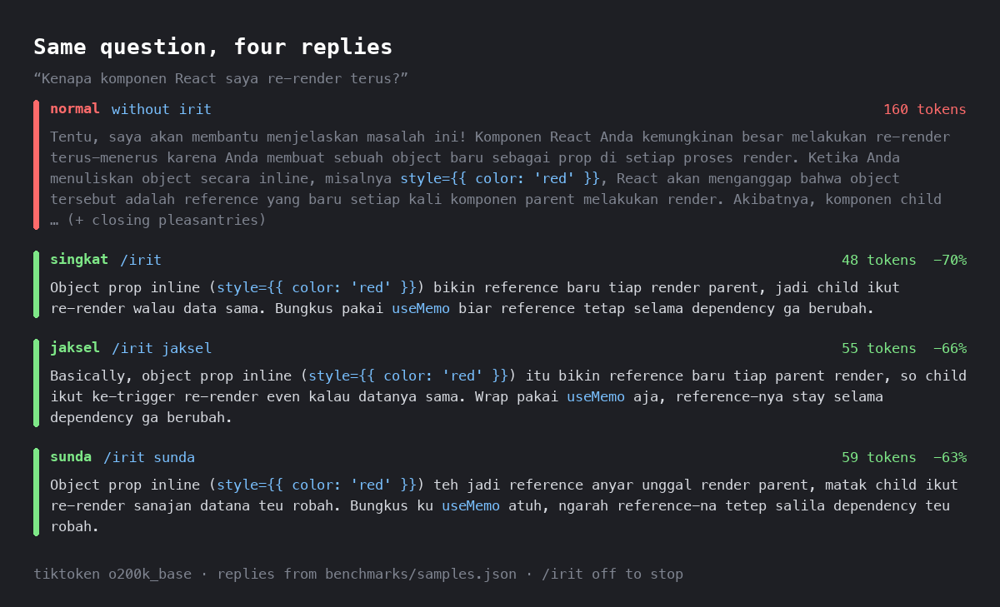
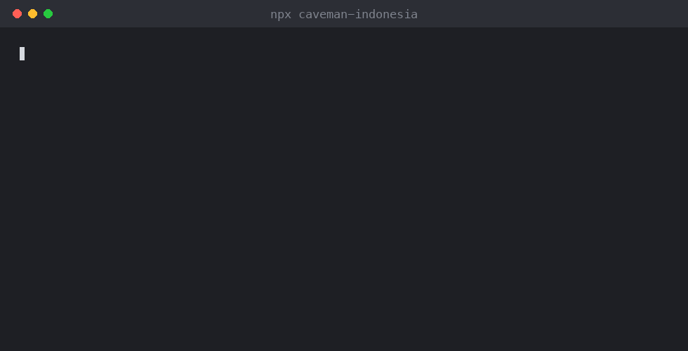

<p align="center">
  
</p>

<h1 align="center">caveman-indonesia 🗿</h1>

<p align="center"><em>Kenapa banyak token kalau sedikit cukup.</em></p>

**irit** is a caveman-inspired agent skill that makes your AI coding agent reply in terse Indonesian. Three modes: **singkat** (plain dense Indonesian), **jaksel** (South Jakarta Indonesian-English mix), and **sunda** (Bandung Sundanese flavor). Code, commands, and error strings stay untouched.

<p align="center">
  
</p>

<sub>Scripted replay of a benchmark sample, not a live model session. Regenerate with `python demo/render.py`.</sub>

## Modes



## Benchmark

Reproducible with `python benchmarks/run.py`. Six hand-written reply pairs, counted with OpenAI tiktoken.

| Mode | o200k_base | cl100k_base |
|---|---|---|
| normal | 868 | 1051 |
| singkat | 307 (-64.6%) | 357 (-66.0%) |
| jaksel | 340 (-60.8%) | 369 (-64.9%) |
| sunda | 350 (-59.7%) | 407 (-61.3%) |

What these numbers are and are not:

- The samples are written by hand to show what each mode should produce. They are not live model outputs. Real savings depend on how well your model follows the skill.
- tiktoken is a proxy. Claude and Gemini use different tokenizers, so exact counts will differ.
- The dialect modes cost a few points more than singkat. Sundanese function words and affixed English verbs are often 2 tokens instead of 1. That is the price of sounding like Bandung or South Jakarta instead of Indonesian with one particle on top.
- The skill itself costs about 1,030 tokens (o200k) each time it loads. It pays off after a few replies, not on a single short answer.

## The one rule that matters: short is not cheap

Indonesian chat abbreviations look shorter but usually cost more tokens, because tokenizers know the full words and split the abbreviations into pieces.

| Full | Tokens | Abbreviation | Tokens |
|---|---|---|---|
| tidak | 1 | tdk | 2 |
| sudah | 1 | udh | 2 |
| dengan | 1 | dgn | 2 |
| karena | 1 | krn | 2 |
| juga | 1 | jg | 2 |

(o200k_base, with leading space.) So irit bans these and saves tokens by cutting greetings, closers, hedging, and restated questions instead. The benchmark script fails if any banned abbreviation turns out not to be more expensive, or if the list in `SKILL.md` drifts from the one in the script. It also checks dialect density: sunda samples must be at least 25% Sundanese loma words with no lemes or cohag forms, and jaksel samples at least 10% English markers.

## Install

Pick one.

**npm** (detects Claude Code, Kiro, Codex, Cursor, Gemini CLI, Antigravity, OpenCode, GitHub Copilot):



```bash
npx caveman-indonesia                       # install into every detected agent
npx caveman-indonesia --agent claude-code   # or pick agents: kiro,codex,cursor,...
npx caveman-indonesia --project             # current project instead of home dir
npx caveman-indonesia list                  # where is it installed
npx caveman-indonesia uninstall
```

Add `--dry-run` to preview. The installer never overwrites or deletes a folder named `irit` that is not this skill unless you pass `--force`.

**Claude Code plugin marketplace:**

```
/plugin marketplace add Leon24k/caveman-indonesia
/plugin install irit@caveman-indonesia
```

Plugin skills are namespaced, so the command is `/irit:irit`. Saying "mode irit" works too.

**[skills CLI](https://skills.sh)** (70+ agents):

```bash
npx skills add Leon24k/caveman-indonesia        # current project
npx skills add Leon24k/caveman-indonesia -g     # all projects
```

**Manual copy:**

```bash
git clone https://github.com/Leon24k/caveman-indonesia.git && cd caveman-indonesia
mkdir -p ~/.claude/skills && cp -R skills/irit ~/.claude/skills/   # Claude Code
mkdir -p ~/.kiro/skills && cp -R skills/irit ~/.kiro/skills/       # Kiro
```

For other agents, copy `skills/irit/SKILL.md` into the agent's skills folder, or paste its body into your `AGENTS.md` or rules file.

## Usage

| Say | Effect |
|---|---|
| `/irit` or "mode irit" | Turn on, default mode singkat |
| `/irit jaksel` | Jaksel mode |
| `/irit sunda` | Sunda mode |
| `/irit off` or "mode normal" | Back to normal replies |

Same question, three modes:

- **singkat:** Object prop inline bikin reference baru tiap render, jadi child re-render. Bungkus pakai `useMemo`.
- **jaksel:** Basically object prop inline bikin reference baru tiap render, so child ke-trigger re-render. Wrap pakai `useMemo` aja.
- **sunda:** Object prop inline teh jadi reference anyar unggal render, matak child re-render wae. Bungkus ku `useMemo` atuh.

## Safety

irit steps aside and the agent writes full, clear Indonesian for security warnings, irreversible actions (deleting data, force push, dropping tables), ordered steps that could be misread, and when you are confused or repeat a question. Anything persisted outside the chat (code, comments, commit messages, PRs, docs) is always written normally.

## Run the benchmark

```bash
python3 -m venv .venv
.venv/bin/pip install -r requirements.txt
.venv/bin/python benchmarks/run.py         # table + checks, exit 1 on failure
.venv/bin/python benchmarks/run.py --json  # machine-readable
```

To add a sample, append an entry to `benchmarks/samples.json` with `normal`, `singkat`, `jaksel`, and `sunda` replies.

## Development

```bash
npm test    # installer tests (node:test, no dependencies)
```

Releasing: bump `version` in both `package.json` and `.claude-plugin/plugin.json` (a test fails if they differ), then `npm publish`.

## Credits

Inspired by [caveman](https://github.com/JuliusBrussee/caveman) by Julius Brussee (MIT-licensed skills). irit is an independent rewrite for Indonesian, not a fork.

## License

MIT
